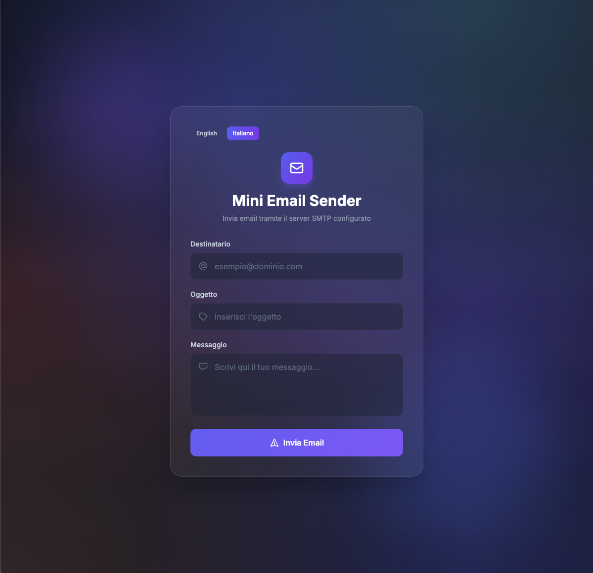
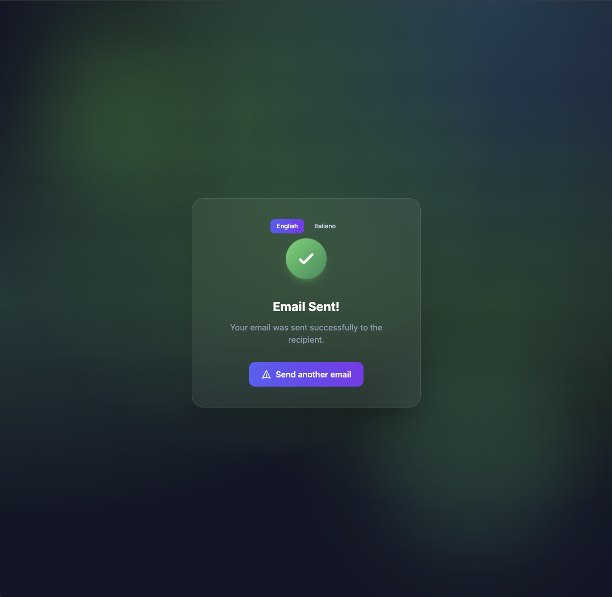
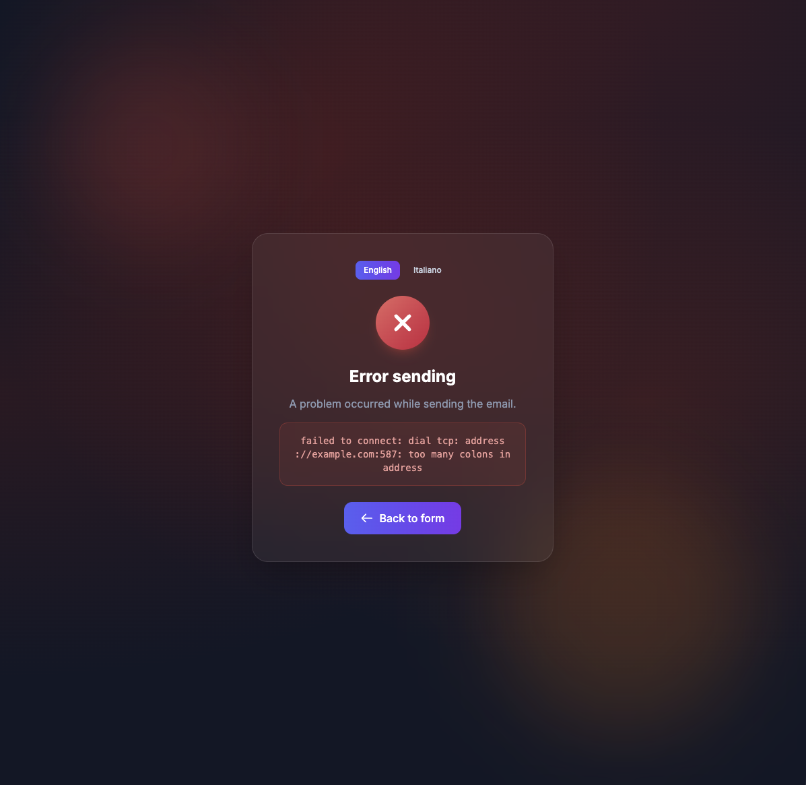

# Mini Email Sender

[](https://golang.org)
[](LICENSE)
[](Dockerfile)
[](CONTRIBUTING.md)

A minimal, self-hosted web UI for **sending ad-hoc emails through any SMTP server**.

It was born out of a real, recurring frustration: when [Mailpit](https://github.com/axllent/mailpit) (or any other local SMTP capture/relay tool) is configured in **SMTP relaying** mode, the application under development can no longer use the captured inbox to send messages — it forwards them to the real upstream server instead. There is no built-in "compose" button to write a quick test message and observe how it lands in the inbox.

**Mini Email Sender** fills that gap. Point it at *any* SMTP server (Mailpit, MailHog, Gmail, your ISP relay, a corporate MTA…), open the browser at `http://localhost:8080`, type the recipient, subject and body, hit *Send*. Done.

> ⚠️ **Use it on trusted networks only.** Anyone who can reach the web UI can send email as you. There is intentionally **no authentication layer** — it is a developer tool, not a multi-tenant SaaS.

---

## Table of Contents

- [Features](#features)
- [Screenshots](#screenshots)
- [Why this project?](#why-this-project)
- [Quick Start](#quick-start)
- [Docker](#docker)
- [Configuration](#configuration)
  - [SMTP host & port](#smtp-host--port)
  - [TLS modes](#tls-modes)
  - [Authentication mechanisms](#authentication-mechanisms)
  - [Private certificates & mTLS](#private-certificates--mtls)
  - [Timeouts & defaults](#timeouts--defaults)
  - [Full reference](#full-reference)
- [Localization](#localization)
- [Project structure](#project-structure)
- [Running the tests](#running-the-tests)
- [Roadmap](#roadmap)
- [Contributing](#contributing)
- [Security](#security)
- [License](#license)
- [Acknowledgements](#acknowledgements)

---

## Features

- 📨 **Plain SMTP, no external Go libraries for the protocol** — the SMTP client is implemented from scratch in `internal/smtp` on top of `net/textproto`, so the binary stays tiny and there are no surprise behaviours hidden inside a third-party package.
- 🔐 **Auth mechanisms**: `PLAIN`, `LOGIN`, `CRAM-MD5` and `OAUTH2` (XOAUTH2).
- 🔒 **TLS modes**: `none`, `STARTTLS` and implicit TLS (`ssl_tls`).
- 🪪 **mTLS support** — ship a client certificate and a custom CA from the YAML config.
- 🌐 **Multilingual UI** — English and Italian shipped out of the box, add a new language by dropping a JSON file into `locales/`.
- 🧪 **Unit-tested** SMTP client (greeting, EHLO, MAIL/RCPT/DATA, dot-stuffing, TLS upgrade, QUIT, etc.).
- 🐳 **Docker image & Compose** file ready.
- 🎨 **Modern, responsive UI** built with [Tailwind CSS](https://tailwindcss.com) (loaded from CDN — no build step required).

---

## Screenshots


*The clean compose form with language switcher.*


*After a successful send.*


*When the SMTP server rejects the message.*

---

## Why this project?

I kept losing time on the same scenario:

1. I run Mailpit locally on port `1025` to capture all outbound mail from the app I am developing.
2. For any reason (manual QA, sharing an email with a colleague, testing templates) I need to **send a one-off email** and watch it appear in Mailpit's web UI.
3. I switch Mailpit to *SMTP relaying* (so emails actually go somewhere real) and I lose the ability to compose a message from inside Mailpit.
4. I open `telnet localhost 1025` and type SMTP commands by hand. Every. Single. Time.

So I wrote a small web form that does exactly the SMTP transaction I would otherwise type manually — nothing more, nothing less. It works against **any** SMTP server, not just Mailpit, so it doubles as a quick "is my SMTP configuration correct?" probe.

---

## Quick Start

### Prerequisites

- **Go 1.22 or newer** (the module declares `go 1.27.0`; any toolchain ≥ 1.22 will work)
- A reachable SMTP server (Mailpit on `localhost:1025`, MailHog on `localhost:1025`, Gmail on `smtp.gmail.com:587`, …)

### Run it locally

```bash
# 1. Clone
git clone https://github.com/<your-username>/Mini-Email-Sender.git
cd Mini-Email-Sender

# 2. Adjust config.yaml to point at your SMTP server
$EDITOR config.yaml

# 3. Build & run
go run .
```

Open <http://localhost:8080> in your browser, fill in the form, hit *Send Email*.

---

## Docker

A minimal multi-stage `Dockerfile` and a `compose.yaml` are provided.

```bash
# Build the image
docker build -t mini-email-sender .

# Run, mounting your local config.yaml so you can edit it freely
docker run --rm -p 8080:8080 -v "$(pwd)/config.yaml:/config.yaml" mini-email-sender
```

Or with Compose:

```bash
docker compose up --build
```

The container listens on `8080` and serves the form from `/`.

---

## Configuration

Everything lives in **`config.yaml`** at the project root. The structure is fully validated at startup — bad values (missing host, unsupported TLS mode, mismatched mTLS paths…) cause the process to exit with a human-readable message instead of crashing at runtime.

### SMTP host & port

```yaml
smtp:
  host: "localhost"      # or smtp.gmail.com, mail.example.com…
  port: 1025             # 25, 465, 587, 1025, 2525…
  local_name: "localhost" # HELO/EHLO identifier
```

### TLS modes

| `tls.mode`    | When to use                                         | Typical port |
| ------------- | --------------------------------------------------- | ------------ |
| `none`        | Local development, trusted LAN relays               | `25`, `1025` |
| `starttls`    | The most common "production" mode                     | `587`        |
| `ssl_tls`     | Implicit TLS from the very first byte (SMTPS)       | `465`        |

### Authentication mechanisms

| `auth.mechanism` | Required fields                              | Notes                              |
| ---------------- | -------------------------------------------- | ---------------------------------- |
| `PLAIN`          | `username`, `password`                       | Default. Username may be the full email. |
| `LOGIN`          | `username`, `password`                       | Legacy mechanism, still common.    |
| `CRAM-MD5`       | `username`, `password`                       | Use only when PLAIN/LOGIN are blocked. |
| `OAUTH2`         | `username`, `token`                          | `XOAUTH2` flow (e.g. Gmail with App Passwords). |

Disable auth for **anonymous corporate relays** by setting `auth.enabled: false`.

### Private certificates & mTLS

For restricted networks you can:

- Trust a private CA: uncomment `tls.ca_cert_path`.
- Present a client certificate (mTLS): uncomment `tls.client_cert_path` and `tls.client_key_path`.

Both files are stat-ed at startup; a missing file is reported as a configuration error.

### Timeouts & defaults

```yaml
timeouts:
  connect: "10s"   # TCP dial timeout
  send:    "30s"   # DATA transmission timeout

defaults:
  from_address: "noreply@example.com"
  from_name:    "Your Go Application"
```

### Full reference

See [`config.yaml`](config.yaml) — every field is commented and ships with a safe default-ish value.

---

## Localization

Translations live in `locales/<code>.json`. Two are included:

- `it.json` — Italian (default fallback)
- `en.json` — English

To add a new language:

1. Copy `locales/en.json` to `locales/<code>.json` (BCP-47 codes are recommended: `de`, `fr`, `es`…).
2. Translate the values. Keep the keys intact.
3. Restart the server — the language will be picked up and added to the language switcher automatically.

The active language is detected from the `?lang=` query parameter, the `Accept-Language` header, and finally defaults to `it`.

---

## Project structure

```
.
├── config.yaml                 # Main configuration (SMTP, TLS, auth, defaults)
├── main.go                     # HTTP server entry point
├── go.mod / go.sum
├── Dockerfile                  # Multi-stage build, distroless-style minimal image
├── compose.yaml                # One-command local stack
├── internal/
│   ├── smtp/
│   │   ├── client.go           # From-scratch SMTP/STARTTLS/TLS client
│   │   ├── auth.go             # PLAIN / LOGIN / CRAM-MD5 / OAUTH2 authenticators
│   │   ├── config.go           # YAML struct + strict validation
│   │   └── client_test.go      # Unit tests with a fake SMTP server
│   └── i18n/
│       └── i18n.go             # Translation manager + template helpers
├── locales/
│   ├── en.json
│   └── it.json
├── templates/                  # html/template files (form / success / error)
└── static/                     # CSS + JS (Tailwind CDN config)
```

---

## Running the tests

```bash
go test ./...
```

The SMTP client suite spins up an in-memory fake server and exercises:

- greeting parsing,
- `EHLO` response handling,
- `STARTTLS` upgrade & post-upgrade `EHLO`,
- `MAIL FROM` / `RCPT TO` / `DATA` pipeline,
- dot-stuffing of message bodies,
- clean `QUIT`/`Close` behaviour.

---

## Roadmap

- [ ] Optional basic-auth in front of the web UI (off by default).
- [ ] Multiple recipients + CC/BCC.
- [ ] Attachments (multipart/mixed).
- [ ] HTML body with side-by-side plain-text preview.
- [ ] "Save as draft" to local file.
- [ ] Prometheus metrics endpoint.

---

## Contributing

Contributions are very welcome — see [`CONTRIBUTING.md`](CONTRIBUTING.md) for the workflow, code style and how to send a Pull Request. By participating you agree to abide by our [`CODE_OF_CONDUCT.md`](CODE_OF_CONDUCT.md).

---

## Security

This tool is intended to run on a **trusted local network**. It will happily send email on behalf of whoever fills in the form. If you expose it to the internet, **at minimum** put it behind a reverse proxy with HTTP Basic Auth — see [`SECURITY.md`](SECURITY.md) for the threat model and how to report vulnerabilities.

---

## License

Released under the **MIT License**. See [`LICENSE`](LICENSE) for the full text.

---

## Acknowledgements

- Inspired by the everyday developer workflow around [Mailpit](https://github.com/axllent/mailpit) and [MailHog](https://github.com/mailhog/MailHog).
- UI styling courtesy of [Tailwind CSS](https://tailwindcss.com).

---

<div align="center">
<sub>Made with care by developers, for developers.</sub>
</div>